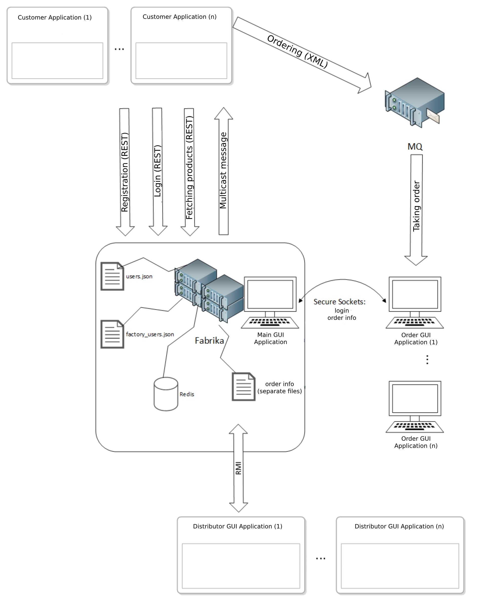

# Factory Network and Distributed Applications

## Description

A project where network technologies such as REST, RMI, Secure Sockets, Message Queues, Multicast are used. There are also implementations of sending mail, XML validations and Redis database.

## Image of communication processes

